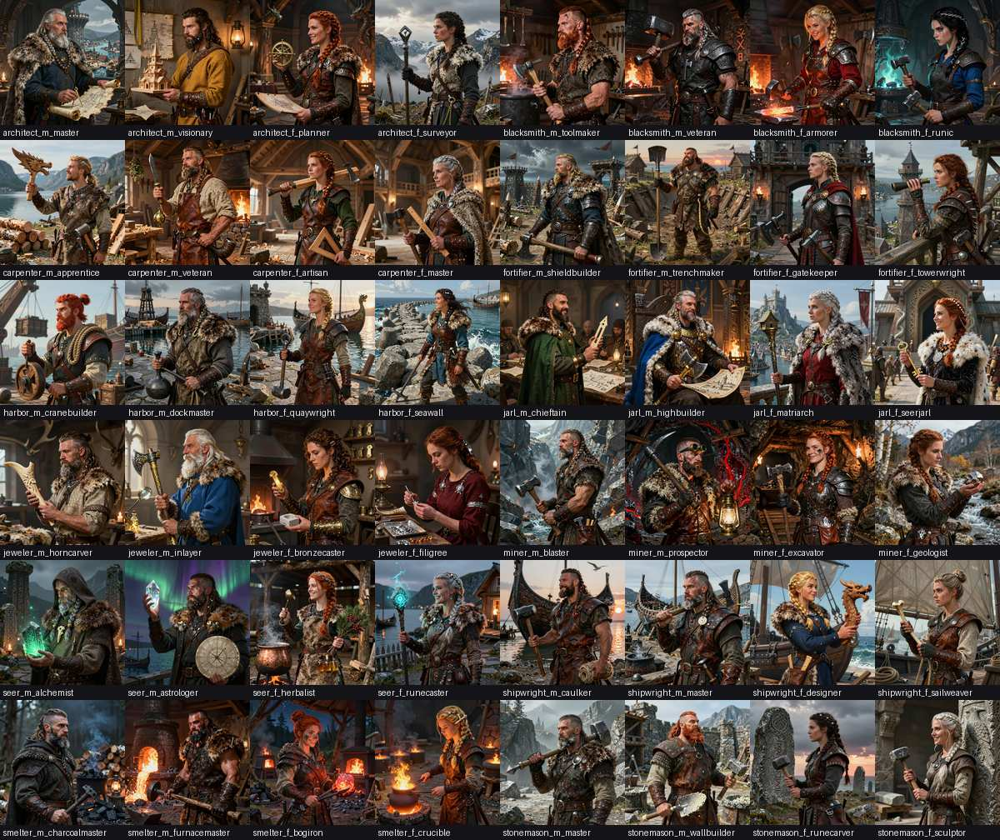
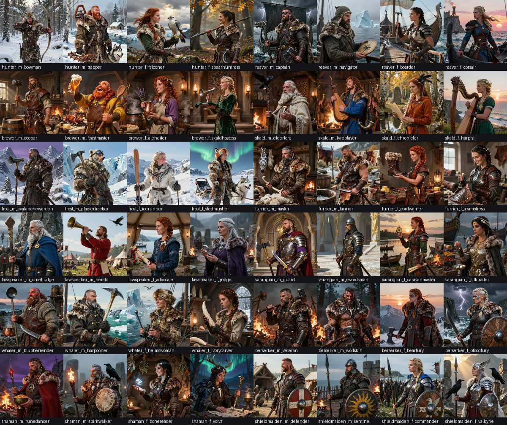
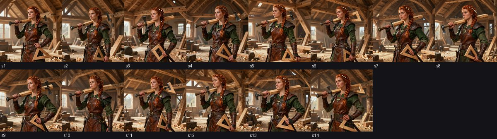
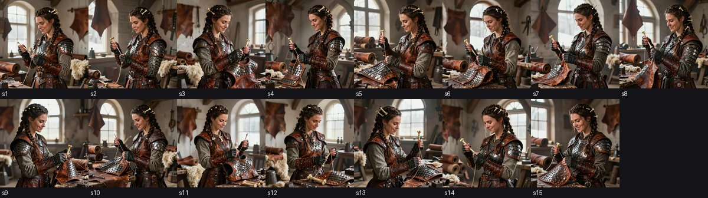
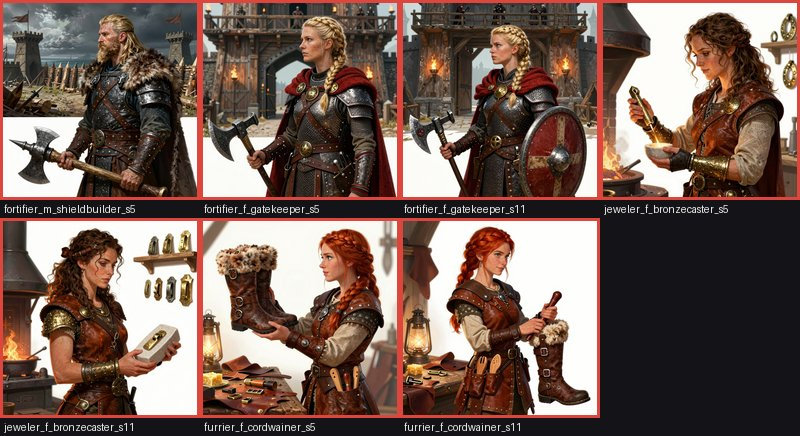
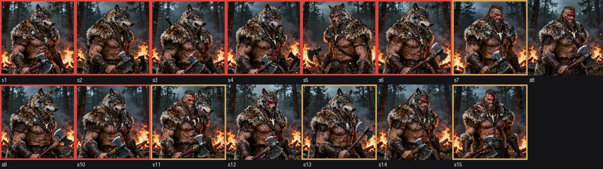

# Viking portrait corpus → profile-picture picker

Design record for the 2026-09-10 portrait corpus and the picker it feeds. Three things live
here: the **analysis** of what the DMos image lane produced, the **categorization** that
turns 1,375 files into something a dropdown can narrow, and the
[**functional requirements**](FUNCTIONAL-REQUIREMENTS.md) for letting a Chronicles builder
choose a portrait instead of wearing the hash-assigned one.

| artifact | where | what |
|---|---|---|
| the corpus | `E:\omen\DMos\artifacts\corpus-viking-profiles-20260910\` (`assets/`, `receipts.ndjson`) | 1,375 × 1024² PNG, 1.98 GB; never enters git |
| `catalog.json` | beside the corpus, 1.4 MB | one row per asset: sha, decode, border/white stats, face signals, reject reasons |
| `face_qa.json`, `attributes.json`, `attributes-work/` | beside the corpus | detector output; the door's classification of the 96 prompts, batch by batch with its metadata |
| `qa/contact-<concept>.jpg` | beside the corpus, 96 sheets | the human pass: every take labelled, picks gold, rejects red |
| [`concepts.json`](concepts.json) | this folder, 205 KB | the 96 portraits with tags, attributes, variance, curated takes — **the file a picker reads** |
| [`picks.json`](picks.json) | this folder | human verdicts that override the auto ranking |
| [`naming-reconciliation.md`](naming-reconciliation.md) | this folder | slug ↔ label ↔ character-name decisions, UI vocabulary |
| [`contact-sheets/`](contact-sheets/) | this folder | six evidence sheets cited below, ≤ 250 KB each |
| tooling | [`tools/portrait-corpus/`](../../../tools/portrait-corpus/) | `build_catalog.py`, `face_qa.py`, `extract_attributes.py`, `contact_sheets.py`, `vocab.json`, tests |
| evidence page | [`docs/evidence/2026-09-11-viking-portrait-corpus.md`](../../evidence/2026-09-11-viking-portrait-corpus.md) | digests and byte counts |

Claims below are **VERIFIED** (measured on the files this session) unless marked INFERRED.

## The corpus

Rendered 2026-09-10 23:10 → 2026-09-11 03:11 UTC on the two B70s (`b70@bus4` 686 jobs,
`b70@bus9` 689), 18 steps, square 1024², a median 18.6 s per image and 7.3 GPU-hours in all.
Every file has a receipt with `asset_id, concept_id, character_name, discipline, gender, seed,
seed_idx, sha256, prompt, batch, lane, duration_seconds, created_at`.

The filename is the taxonomy: `viking_<archetype>_<f|m>_<variant>_s<N>`, and all 1,375
match it. 24 archetypes × 2 presentations × 2 variants = **96 concepts**; 31 concepts have 15
seeds, 65 have 14. Within a concept the prompt and the character name are constant — **only
the seed varies** — and the 15 seed integers are shared across concepts by index (`s5` is
7461928301 everywhere). Five generation batches: Builder Profiles 672, Northern Trades 293,
Warriors & Mystics 178, Lore & Hearth 120, Hunters & Reavers 112.




## Finding 1 — seeds are takes, not a dimension

The picker question is whether 1,375 means 1,375 choices. It does not. At 18 steps with a
600-word prompt the model is close to deterministic: the takes of a concept share pose,
composition, framing and face, and drift only in expression, left/right facing and prop
detail. Measured as the mean absolute deviation of 48 px greyscale thumbnails from the
concept mean, the 96 concepts span 0.051 (`blacksmith_f_runic`) to 0.149
(`furrier_f_seamstress`), median 0.093 — a 3× band, with nothing in the corpus that reads
as "a different picture of the same person".

| | |
|---|---|
|  |  |
| the most locked kind of concept: 14 takes of `carpenter_f_artisan` | the loosest: 15 takes of `furrier_f_seamstress` — facing flips, framing shifts, same sitter |

So the corpus is **96 portraits × ~14 takes**, and the picker's job is to narrow 96, then
offer a short strip of takes. That decision (curate ~4 takes per portrait, "more takes" for
the rest) was taken with Derek on 2026-09-11 and is what `concepts.json` encodes: 384 picked
takes across 96 portraits.

## Finding 2 — what is wrong with the files

17 of 1,375 assets are unusable; `catalog.json` carries the reason on each.

| reject | n | what |
|---|---|---|
| `corrupt` | 2 | `carpenter_m_veteran_s1` and `miner_m_prospector_s1` are **one broken 1,655,768-byte blob written to two paths** — identical sha256, both 355 s in the receipts against a 19 s median: a job collision on the lane. The receipt sha matches the bad bytes, so sha-verification passes on a file that will not decode; decode is the check. |
| `bg_dropped` | 7 | the painter left a blank white studio or an unfinished white patch instead of the prompted background. All seven are **seed `s5` or `s11`** (7461928301, 1928374650) across four concepts (`fortifier_f_gatekeeper`, `fortifier_m_shieldbuilder`, `furrier_f_cordwainer`, `jeweler_f_bronzecaster`). Detected as whole-frame near-white fraction > 0.08 over the concept's own median — per-concept, so snow and ice concepts with pale frames are not caught. |
| `rejected_by_eye` | 8 | `berserker_m_wolfskin` s1–s6, s9, s10: the prompt's "wolf pelt" was painted **as a wolf's head**; there is no human face to be a profile picture. Seven human-faced takes remain. |



A softer, unrejected pattern the picker has to respect: trades whose prompt has the sitter
working (`furrier_f_seamstress`, `furrier_f_cordwainer`, `jeweler_f_bronzecaster`) look
**down at their hands**, and the more full-body compositions (`harbor_f_seawall`,
`hunter_m_bowman`, `fortifier_m_trenchmaker`, `lawspeaker_m_herald`) put the face under 10 %
of the frame. Both are fine as a hero image and poor as a 128 px tile; the catalog's
`face_small` flag and the bust crop address them (Finding 3).

## Finding 3 — no automated face gate can be trusted on this art

A profile picture at 128 px is a face, so the plan was a face detector to (a) reject takes
without a visible human face and (b) derive a face-centred bust crop. Every detector tried
failed the one concept that matters, the wolfskin berserker:

| detector | result on 15 wolfskin takes (8 wolf-headed, 7 human) |
|---|---|
| OpenCV Haar (frontal default + alt2 + profile, both mirrors) | a "face" in all 15 — the wolf's face passes |
| mediapipe BlazeFace full-range | no face in any of the 15, including the plain human ones |
| mediapipe BlazeFace short-range | faces on the rune-tattooed chests of 10 takes, in the lower half of the frame |
| gemini-3.5-flash on a 15-up sheet (256 px tiles) | 5 of 15 wrong |
| gemini-3.5-flash on a 4-up sheet (480 px tiles) | 2 of 4 wrong — calls a snarling wolf a "screaming human face" |
| gemini-3.1-pro on the same 4-up sheet | 1 of 4 wrong — a clear wolf head called "bearded human in a hood" |

Photo-trained detectors and vision models do not agree with a human on what a painted face
is. So [`face_qa.py`](../../../tools/portrait-corpus/face_qa.py) demotes them to **ranking
signals**: three detectors vote, only boxes in the head zone count (upper 55 % of the frame,
middle 80 % — the false positives on chests and props live outside it), and the vote count
orders takes within a concept. Across the corpus 862 assets get all three votes, 353 two,
139 one, 19 none. Nothing is rejected on a detector's word. The **gate is the human pass**
over `qa/contact-<concept>.jpg`, recorded in `picks.json` — exactly the slate48 library's
rule ("everything else is a human call on the contact sheet"). One concept has been through
that pass; the other 95 carry auto picks marked `source: auto` until they are reviewed, which
the FR makes a precondition of publishing a portrait.



The derived bust crop (square, 3.2 × face height, face centre 38 % down) is still recorded
per asset; where no detector voted, the crop is the composition default `[192, 0, 640]`,
which holds because every concept in the corpus frames the head there.

## The categorization

Two sources, kept apart because they answer different questions.

**What was asked for** (per concept, stable across takes) comes from the prompt, classified
through the HEARTH door against the closed vocabularies in
[`vocab.json`](../../../tools/portrait-corpus/vocab.json) — eight batches of 12 prompts to
`gcp-gemini` / `gemini-3.5-flash` (job ids in `attributes.json`), every value validated,
zero off-vocabulary. The first pass defaulted `hair` for 27 concepts, all men, because their
prompts name the *beard* colour; one instruction line ("when only a beard colour is stated,
use it") fixed that at the source. A pixel measurement of the hair band was tried and
discarded: it agreed with the prompt on 24 of 67 concepts, fur collars and backgrounds winning.

| axis | distribution over 96 portraits | facet? |
|---|---|---|
| `role` (24) | 4 each | Trade — dropdown |
| `presentation` | woman 48 · man 48 | segmented |
| `theme` (5) | builders 48 · trades 20 · warriors-mystics 12 · hunters-reavers 8 · lore-hearth 8 | dropdown |
| `age` | adult 79 · elder 13 · young 4 (59 unstated → adult) | segmented |
| `hair` | brown 21 · red 20 · blonde 20 · dark 18 · grey 17 | dropdown |
| `mood` | warm 31 · proud 26 · calm 23 · stern 12 · fierce 4 | segmented |
| `setting` | workshop 18 · coast 12 · sacred 10 · hall 9 · harbour 8 · fortress 7 · forge 6 · mountain 5 · forest 5 · ship 5 · camp 4 · snow 4 · mine 2 · market 1 | dropdown |
| `palette` | ember 38 · golden 23 · cool 16 · daylight 12 · storm 3 · aurora 3 · night 1 | dropdown |
| `kit` | civilian 70 · armoured 21 · robed 5 | segmented |
| `companion` | none 90 · dog 2 · raven 2 · falcon 1 · other 1 | not a facet (too sparse); shown as a chip on the tile |
| `headwear`, `beard`, `hair_style`, `magic` (5), `face_paint` (7), `props[]` | recorded | not facets |

The hair skew Derek noticed on the sheets is real but it is a **women's** skew: red 15 and
blonde 14 of the 48 women, against brown 16 and grey 13 of the 48 men. Age is thin — the
prompts rarely say it, and "adult" covers everything from a young joiner to a weathered
master — so the FR keeps Age as a three-way segmented control but expects it to do little
narrowing until a future pass reads age off the picked take.

**What was painted** (per take) is the QA above: decode, background, face signals, and the
human verdict. It never becomes a filter; it decides which takes are offered.

## Relationship to the 48-tile library

The Chronicles builder pages already wear a portrait from the **slate48** library
(`ComfyStewardView/tools/chronicles/portraits/`, 12 roles × young/elder × woman/man,
`portraitIndex = parseInt(key[:8],16) % 48`). The two libraries differ in almost every way
that matters for serving, and the FR is written so both live in one manifest:

| | slate48 | viking96 |
|---|---|---|
| framing | bust, head and shoulders | waist-up, prop in hand |
| background | flat dark slate, one ember accent | full painted scene |
| tags | role · age · presentation | role · presentation · theme · age · hair · mood · setting · palette · kit (+ non-facet attributes) |
| takes | one per tile, reseed on reject | 14–15 per portrait, ~4 curated |
| served cut | 512 + 128 webp of the whole frame | bust crop for ≤ 128 px; wide cut for the hero card |
| names | none by rule | present in the catalog, never in UI (naming note §3) |
| assignment | hash slot, no state | chosen; hash slot remains the default |

Five trades overlap (`blacksmith`, `brewer`, `hunter`, `shipwright`, `stonemason`);
`joiner`/`carpenter` is an alias; the rest are distinct.

## Rebuilding the catalog

```
python tools/portrait-corpus/build_catalog.py --corpus E:\omen\DMos\artifacts\corpus-viking-profiles-20260910
<cvenv>\python tools/portrait-corpus/face_qa.py --corpus <corpus> --catalog <corpus>\catalog.json
set HEARTH_KEY=…  &  python tools/portrait-corpus/extract_attributes.py call --batch-size 12 --concepts docs/design/valheim-portrait-picker-2026-09/concepts.json --out <corpus>\attributes-work
python tools/portrait-corpus/extract_attributes.py ingest --batch-size 12 --concepts … --out <corpus>\attributes-work --write <corpus>\attributes.json
python tools/portrait-corpus/build_catalog.py --corpus <corpus> --face-qa <corpus>\face_qa.json --attributes <corpus>\attributes.json --picks docs/design/valheim-portrait-picker-2026-09/picks.json
python tools/portrait-corpus/contact_sheets.py review   --corpus <corpus> --concepts docs/design/valheim-portrait-picker-2026-09/concepts.json
python tools/portrait-corpus/contact_sheets.py evidence --corpus <corpus> --concepts docs/design/valheim-portrait-picker-2026-09/concepts.json
python -m pytest tools/portrait-corpus/test_portrait_corpus.py -q
```

`<cvenv>` is a scratch venv with `opencv-python-headless<5` and `mediapipe==0.10.14` (the
last versions that ship their models in the wheel). `HEARTH_KEY` comes from the operator's
environment — the script reads no sibling checkout. Everything else is the system Python
with PIL and numpy.
