# The Turnkey Quest Lab — objective, architecture, and what is actually true

*Supersedes `zero_derek_turnkey_quest_lab_vision.md` (untracked, repo root, 2026-08-07). That
draft described three friction removers as though all three existed; one did not exist at all,
one was half-built, and one conflicts with a decision already taken. It also said seven schools
where every source in the repo says eight. This is the corrected version. Where something is not
built, it says so.*

---

## 1. Operating context: solo SDLC, and what the constraint actually is

One operator carries every phase — Mono.Cecil transpiles and Harmony patching at one end, web
UI, docs and community stewardship at the other. **Maintainer operational friction is the binding
constraint**, not capability and not ideas.

So the objective is not "a better quest tool". It is:

- **Eliminate setup support.** Nobody should have to ask how to install it, where a file goes, or
  why nothing happened.
- **Make failure self-explaining.** A creator who guesses wrong should be told what went wrong, in
  their own vocabulary, without a maintainer in the loop.
- **Buy back operator bandwidth** for the things only the operator can do.

The measure of success is *how few questions get asked*, not how many features exist.

## 2. The architecture

```mermaid
flowchart TD
    Link["1. /workbench/downloads/quest-lab"] --> Drop["2. Drop ComfyQuestLab.dll into BepInEx/plugins"]
    Drop --> Start["3. Open a private single-player world"]
    Start --> Setup["4. F5 console: lab_setup"]

    Setup --> Gallery["Marked old builds safely cleared; fresh compact course raised"]
    Setup --> Seed["Starter quest file written (only into an empty folder)"]
    Setup --> Panel["F6 opens the zoomable panel: console / spellbook / quests"]
    Setup --> Batch["Optional: questlab_batch prepare/run/report/export"]

    Seed --> Edit["5. Edit the JSON, run lab_reload"]
    Edit --> Verdict["Quests tab: armed, or why not"]

    Tome["Web tome at /questlab"] -.teaches.-> Setup

    style Link fill:#162126,stroke:#75c9f1
    style Setup fill:#11191d,stroke:#d7a86e
    style Verdict fill:#162126,stroke:#68d391
```

**Two keys, and this catches nearly everyone.** `F5` is *Valheim's* console, where `lab_setup` and
`lab_reload` are typed. `F6` opens the *lab's* own panel and transfers mouse ownership to it; the
visible `−` / `+` controls persistently scale the whole panel from 65–200%. The superseded draft
said diagnostics appear "in the F5 overlay"; they appear in the F6 panel.

**Eight schools, not seven:** Combat, Harvest, Inventory, Building, Crafting, Progression,
**World**, Social. The draft's list omitted World. The likely origin is a since-corrected roster
line that read "seven of the eight categories are not wired yet".

## 3. The friction removers — status, honestly

### A. Hot-reloadable quest iteration (`lab_reload`) — **BUILT 2026-08-07**

Re-reads every `*.json` under `BepInEx/config/comfy-quest-lab/quests/` on demand and reports a
**diff by name** (`+ first_blood`, `~ punchwood (trigger changed)`, `= 3 unchanged`). A diff is
what makes a hot-reload trustworthy — "reloaded" alone never tells a creator that the file they
just saved is the file the lab just read.

Three design facts worth carrying forward:

- **Each file is a whole `quest-view.json`**, not a fragment, so any of them can be copied
  byte-for-byte to `comfy-network-sense/quest-view.json` and the shipping mod accepts it unchanged.
  That round trip is the lab's entire promise.
- **`lab_target` keeps the loop closed.** Editing and reloading is worthless if the second test
  means going to find another thing to kill. The gallery's stations are placed once, so the first
  seed — which targeted a Neck at some shoreline — cancelled the practice ground it was seeded
  beside. The seed now targets the Greyling under the combat monument, `lab_target` restocks any
  school's station in front of the player, and a test asserts the seed's target against the
  gallery plan so the two cannot drift apart again.
- **Files parse independently.** One typo'd draft costs its own quests and nothing else.
- **Reload drops cooldowns**, diverging from the shipping mod's session-long 60 s on purpose.
  Recorded in [`network/tuning-ledger.md`](../network/tuning-ledger.md).

> The draft located quest files at `BepInEx/config/ComfyQuestLab/`. The actual config directory is
> hyphenated, `comfy-quest-lab/`, matching every other path the mod uses.

### B. Self-explaining failure boundaries — **BUILT, in three tiers**

The draft attributed this to `LabEventRing`. The ring is a bounded event buffer that prints
nothing; the panel is what explains things. What exists:

1. **Contract errors**, passed through **untouched** from `QuestViewLoader.Parse`, with a
   lab-written remedy appended as a clearly separate sentence. Rewording them is how the lab would
   start lying about the shipping mod.
2. **Armability verdicts** — why a quest cannot fire, naming the creator's own trigger verb.
3. **Advisories** — a mistyped `weapon_skill` with the nearest real one, a target in no catalog,
   `projectile: true` on a melee-only skill, a duplicate `quest_id`, `shots` that carry no
   behaviour.

Plus the **patch-seam roster** (`questlab_seams`), which reports a seam that moved in a game
update as unavailable rather than taking the mod down.

> The draft's example message — *"count condition expected positive integer"* — names a field the
> schema does not have. Quest-view v1 has no counts. Inventing one would produce quests the
> shipping mod cannot load, which is exactly what the shared contract exists to prevent.

### C. One-click quest export (`lab_export`) — **NOT BUILT, and deliberately deferred**

The draft describes it as emitting "a formatted Quest Submission Bridge payload into the outbox
folder". That path was removed on purpose:
[fieldlab ADR-0018 — quest proof is the EventLog row](../fieldlab/docs/adr/0018-quest-proof-is-the-eventlog-row.md)
replaced outbox payloads with a durable server EventLog row as the proof of completion, and
`tools/quest-bridge/bridge_consumer.py` now explicitly rejects schema-1 outbox payloads.

If this is revived, it should be scoped as **sharing an authored quest definition**, not as
submitting a completion — the former does not conflict with ADR-0018 and the latter does.

## 4. The contract the whole design turns on

**All eight schools are hooked, and every safe canonical event is bindable through one shared
evaluator.**

`QuestTriggerEvaluator` — shared by source-link with the shipping mod, not reimplemented — accepts
all 34 safe canonical events and preserves `hit` as an alias for creature or resource damage. The
lab's central router converts 57 safe method signatures into those stable names. It also gives
local/RPC and overload witnesses one bounded action key, so a creator testing with cooldown zero
cannot complete the same quest twice from one action.

The atlas still matters because not every observable mutation is a safe creator action. All 86
practical signatures can be inspected; low-level inventory mutations, received chat, and other
corroborating witnesses appear only under the diagnostic profile and are structurally barred from
quest evaluation. Four query/cheat signatures are deliberately disabled.

Every design choice follows from making that boundary visible:

- Armed state is decided by **dry-firing the real evaluator**, not by a predicate restating its
  rules — a mirror predicate is what drifts into a comfortable lie.
- Every console row carries a usability verdict.
- The seed carries both the backward-compatible `kill` quest and the broad `hit` alias, and both
  are armed through the same evaluator dry-run.

Related: the lab's own console once promised that `trigger.target` should be typed exactly as
shown, while the matcher compared against the creature's `m_name` localization token. For
`Greydwarf_Elite` vs `$enemy_greydwarfbrute` those share nothing. Fixed 2026-08-07; the console
now shows both names whenever they disagree.

### Bounded evidence without a maintainer

`questlab_batch prepare all-schools` writes one ordinary, bindable example quest per school,
safely clears every marked old build, and raises one fresh compact course. The birch, Greyling,
tools, arrows, wood, smelter coal, mounted picnic food, and raised/lit `sign here` sign are all
at their point of use. The Birch, bronze axe, and picnic table stay on natural terrain before
the ascent portal; the reversible deck clears the measured Meadows canopy without deleting it, so
a fresh character needs no prior inventory or directions from Derek. `run` records real canonical actions and their quest
completions; `report`, `reset`, and `export` make repeated testing a suite rather than eight
one-off console experiments. Receipts explicitly count raw witnesses, canonical actions,
coalesced alternatives, and same-action double completions.

The second suite, `creator-events`, is a fast source-shared evaluator proof for all 34 safe
events. Its receipt says `synthetic-contract`; it cannot graduate a school to “witnessed”.
The i5 helper can deliver only ten expiring, allowlisted suite/gallery operations through the
SHA-verified config lane. It has no general console, keystroke, arbitrary path, or prefab field.

## 5. The creator journey

1. **Discovery** — the Community Workbench (`/workbench`) or the Discord thread.
   *Correction: the draft named the [Absorption Loop](https://djcdevelopment.github.io/baseline/absorption-loop/)
   essay as a discovery path. That essay does not mention the Quest Lab. Either it gains a link or
   it is not a path.*
2. **Download** — `/workbench/downloads/quest-lab`, SHA-256 verified at four layers, the last of
   them recomputed server-side per request before a byte streams.
3. **Onboarding** — `lab_setup`; the web tome at `/questlab` teaches the eight schools and now
   carries the install steps it lacked until 2026-08-07.
4. **Experimentation** — edit JSON, `lab_reload`, read the Quests tab.
5. **Submission** — **not built.** See §3C.

## 6. Success criteria, and how we would know

| Criterion | How it would be evidenced | Status |
|---|---|---|
| Zero setup tickets | Nobody asks an install question in the thread | Untested — not yet announced |
| Safe failure | Local-only observer postfixes swallow throws; explicit gallery/suite changes are marked, selective, and bounded | Built and headlessly guarded; all-school live suite passed on r4, exact r10 re-witness pending |
| Flywheel | Community-authored quests posted in the thread | Not started |

**The honest gap as of 2026-08-08:** the generalized contract, parser, action correlator, and all
practical patch targets pass the headless suites and compile against the installed Valheim
assembly. An exact-r4 OMEN suite witnessed all eight schools and completed all eight bindable
example quests with zero same-action double completions; the separate synthetic suite passed all
34 safe evaluator events. r10 changes the panel and physical course, so the final package still
needs those receipts repeated against the exact r10 DLL plus Derek's visual acceptance of the
compact marble build.

## 7. Boundary

Per [`docs/baseline-vision-and-boundary.md`](baseline-vision-and-boundary.md): this is a community
toolkit and must remain extractable. Nothing about the lab may depend on the operator's private
lab infrastructure. It is client-only, local-only, and sends nothing anywhere.
