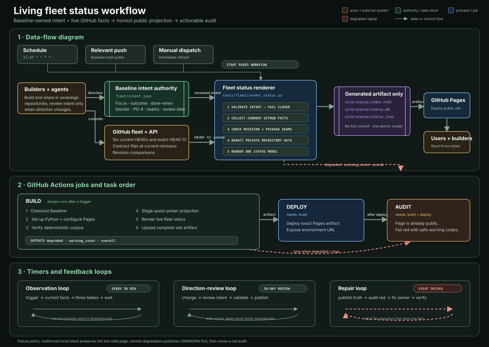

# Living fleet status workflow



The living fleet status turns a small, reviewed statement of direction into a public
snapshot of the whole repository fleet. Baseline owns the intent and the projection;
the sovereign product repositories continue to own their code, releases, CI, and
published contracts.

The workflow is deliberately observation-first. Normal product commits require no
follow-up commit in Baseline. GitHub supplies changing facts automatically, while
humans and agents edit [`intent.json`](intent.json) only when direction changes.

## Boundaries

- Baseline stores durable intent, evidence rules, and seam declarations.
- Product code remains in the repositories named by `intent.json` and `REPO-MAP.md`.
- The collector reads repositories through GitHub at explicit current revisions. It
  never traverses into sibling checkouts.
- Cross-repository seams are checked from immutable revision locks or exact package
  versions. A floating constraint is never reported as a healthy pin.
- Generated status files exist only in the Pages artifact. Scheduled runs do not
  modify the Git tree or create bot commits.

## Inputs and authorities

| Input | Authority | What the collector reads |
| --- | --- | --- |
| `fleet/intent.json` | Baseline | Purpose, current focus, next outcome, completion proof, blocker, PD-4 state, review date, and declared seams |
| Repository branch | Sovereign repository | Current `main` HEAD, commit time, public subject, and commit URL |
| Actions workflow | Sovereign repository | The newest workflow run whose `head_sha` exactly equals current HEAD |
| Revision lock | Consumer repository | The producer revision intentionally consumed at the consumer's current HEAD |
| Package declaration | Producer and consumer repositories | Produced version and exact consumed version at each repository's current HEAD |
| GitHub compare API | Producer repository | Whether a revision pin is current, intentionally behind, or divergent |

An older successful workflow run cannot make a newer commit green. The current HEAD
is established first, and only a run for that exact SHA can yield `PASS`.

## Triggers and timers

The Pages workflow has three automated entry points:

| Trigger | Timing | Why it runs |
| --- | --- | --- |
| Schedule | Minutes `17` and `47` of every hour | Refresh remote repository facts even when Baseline has not changed |
| Push to `main` | When site, corpus, fleet, renderer, fixture, or Pages workflow paths change | Publish a changed site or status contract promptly |
| Manual dispatch | On demand | Force an immediate refresh or validate access after an operational change |

GitHub schedules are best-effort. The unusual minutes avoid the busiest top-of-hour
queue, but they are not a real-time SLA.

The fourth trigger is human rather than temporal: a builder or agent updates
`intent.json` when a project's focus, outcome, proof, blocker, evidence state, or
integration boundary materially changes. Each row becomes review-due after 30 days.

## Jobs and tasks

The workflow in [`.github/workflows/pages.yml`](../.github/workflows/pages.yml) uses
three jobs so publication and accountability are separate outcomes.

### 1. Build

The `build` job:

1. checks out Baseline;
2. installs the pinned Python runtime and configures Pages;
3. proves the committed corpus projections are reconstructable;
4. stages the quest-picker projection into `site/`;
5. runs `tools/fleet/render_status.py` against `fleet/intent.json` and GitHub;
6. writes `site/status/index.html`, `site/status/status.md`, and
   `site/status/status.json`; and
7. uploads all of `site/` as one Pages artifact.

The renderer exposes `degraded`, `warning_count`, and `overall` as job outputs for the
downstream audit. Invalid tracked intent exits with code 2 before status output is
written.

### 2. Deploy

The `deploy` job depends on a successful build and deploys the exact uploaded artifact
to GitHub Pages. The generated status therefore shares one atomic public snapshot with
the rest of the Baseline site.

### 3. Audit

The `audit` job waits for both build and deploy. It runs only when publication
succeeded and the renderer reported `degraded=true`. It then fails intentionally,
leaving two simultaneous facts:

- users can see the honest degraded or unknown state; and
- builders receive a red workflow requiring attention.

This ordering prevents a remote outage or product failure from silently preserving an
apparently healthy old page.

## Data flow

1. Builders and agents land implementation in the sovereign repositories.
2. Direction changes are reviewed into Baseline's intent contract.
3. A timer, relevant Baseline push, or manual dispatch starts the Pages workflow.
4. The renderer validates local intent before making network requests.
5. It reads current repository heads, current-head CI, declared contract files, and
   revision comparisons through the GitHub API.
6. It combines observed facts with reviewed intent into one in-memory status model.
7. Three equivalent public projections are generated from that model.
8. Pages deploys the artifact; the conditional audit then reports degradation.
9. A later product fix, access fix, or intent review closes the loop on the next run.

## State and failure semantics

| Condition | Public result | Workflow result |
| --- | --- | --- |
| Malformed or unsafe tracked intent | No replacement artifact; last valid page remains live | Build fails closed |
| Repository or API unavailable | A sanitized `UNKNOWN` row is published | Deploy succeeds, then audit fails |
| Current-head CI fails | `FAIL` is published | Deploy succeeds, then audit fails |
| No CI run exists for current HEAD | `UNVERIFIED` is published | Deploy succeeds, then audit fails |
| Current-head CI is queued or running | `RUNNING` is published | Not treated as a false failure |
| Revision is not in the current producer history | `DIVERGED` is published | Deploy succeeds, then audit fails |
| Contract is missing, malformed, or floating | `BROKEN` is published | Deploy succeeds, then audit fails |
| Exact revision pin trails producer HEAD, or an exact package pin differs | `PINNED_BEHIND` or `PINNED_DIFFERENT` is published | Informational; audit remains green |
| Intent is 31 or more days old | `STALE` and overall `REVIEW` are published | Freshness warning; not remote degradation |

## Privacy and credentials

Public repositories expose their repository link, abbreviated HEAD, commit subject,
activity age, CI link, and declared direction. Isolate uses `visibility: sanitized`:
only centrally reviewed wording, review state, and coarse CI state enter the public
model. Its repository URL, SHA, subject, workflow URL, file paths, and raw errors are
withheld from HTML, Markdown, and JSON.

The Actions secret `FLEET_READ_TOKEN` must be a fine-grained, read-only token with
Metadata, Contents, and Actions access to the six fleet repositories. The normal
workflow token is used as a public-repository fallback, but it cannot inspect a sibling
private repository.

Tracked public text is rejected if it contains a tailnet endpoint, private local path,
or secret-shaped assignment. All HTML fields are escaped before rendering.

## Operating loops

### Observation loop — automatic

`timer/push/manual -> collect current facts -> publish -> wait for next trigger`

This loop makes normal multi-agent building cheap: commits and CI movement appear
without an agent remembering to update Baseline after every session.

### Direction-review loop — human or agent initiated

`material direction change -> edit intent -> validate -> publish -> 30-day review`

Do not bump `intent_as_of` mechanically. Re-read the row and update the date only when
its focus, outcome, proof, blocker, and evidence classification remain honest.

### Repair loop — event driven

`FAIL/UNKNOWN/BROKEN/DIVERGED -> publish truth -> audit turns red -> repair source or
access -> next run verifies current state`

Repair belongs in the repository that owns the failed fact. Baseline changes only when
the declaration or seam itself is wrong.

## Local verification and preview

Validate intent without network access:

```powershell
python tools\fleet\render_status.py --check-config
```

Run the deterministic fleet test suite:

```powershell
python -m unittest tests.test_fleet_status -v
```

Render a frozen offline preview into a temporary directory:

```powershell
python tools\fleet\render_status.py `
  --fixture tests\fixtures\fleet_status\github.json `
  --now 2026-08-19T12:00:00Z `
  --output <temporary-directory>
```

Run the complete Baseline verification receipt before landing a workflow change:

```powershell
python -m unittest discover -s tests -v
python tools\corpus\test_corpus.py
python tools\corpus\build.py --check
python -m unittest tests.test_entrypoint_links -v
git diff --check
```

## Changing the fleet contract

When adding or changing a repository or seam:

1. edit `fleet/intent.json`;
2. update `tests/fixtures/fleet_status/github.json` with only deterministic synthetic
   GitHub responses;
3. add or adjust an assertion in `tests/test_fleet_status.py`;
4. run the offline renderer and inspect all three projections;
5. run the complete Baseline verification receipt; and
6. manually dispatch Pages after landing if waiting for the next scheduled run would
   obscure an urgent correction.

Never place a credential, private endpoint, sibling checkout path, or unsanitized
private-repository fact in the intent or fixture.
