# Zero-Derek Turnkey Quest Lab Architecture & Strategy

## 1. Operating Context: Solo SDLC & Boundary Testing

As a solo operator managing all phases of the Software Development Life Cycle (SDLC)—from low-level C# reflection, Mono.Cecil transpiles, and BepInEx/Harmony patching to web UI design, documentation, and community stewardship—**maintainer operational friction is the single largest constraint on progress**.

### The Core Objective:
* **Eliminate Technical Support Overhead**: Shift from answering setup/config questions to providing a zero-friction, self-service creator sandbox.
* **Empower Crowd Creativity**: Allow creators to click a link, drop a DLL, press F5, and immediately explore quest hooks safely in their own local world.
* **Free Up Operator Bandwidth**: Enable the maintainer to focus on pushing technical boundaries, gathering creative feedback, and nurturing the community flywheel.

---

## 2. The Turnkey Quest Lab Architecture

```mermaid
flowchart TD
    Link["1. Download Link (/workbench/downloads/quest-lab)"] --> Drop["2. Drop ComfyQuestLab.dll into BepInEx/plugins"]
    Drop --> Start["3. Open Valheim Single-Player World"]
    Start --> Setup["4. Type lab_setup in F5 Console"]
    
    Setup --> Gallery["Practice Gallery Spawns (Dummies, Nodes, Stations)"]
    Setup --> Ring["LabEventRing HUD / Panel Opens"]
    Setup --> Tome["Web Tome (/questlab) Teaches 7 Schools & Runes"]

    style Link fill:#162126,stroke:#75c9f1
    style Setup fill:#11191d,stroke:#d7a86e
    style Gallery fill:#162126,stroke:#68d391
```

---

## 3. The Three Friction Removers (Zero Maintainer Needed)

To ensure creators never get stuck or need manual intervention, the Quest Lab implements three key self-service mechanisms:

### A. Hot-Reloadable Config Iteration (`lab_reload`)
* **Problem**: Restarting Valheim to test a quest config change destroys creative flow.
* **Solution**: `lab_reload` re-reads local quest definitions from `BepInEx/config/ComfyQuestLab/` on the fly, updating active triggers instantly in the single-player session.

### B. Self-Explaining Failure Boundaries
* **Problem**: Raw C# exception stack traces in `Player.log` intimidate non-developer creators.
* **Solution**: The `LabEventRing` catches reflection/patching boundary errors and prints clear, human-readable diagnostics directly in the F5 overlay (e.g. `[Rune Warning]: Item 'Wood' recognized, but count condition expected positive integer`).

### C. One-Click Quest Export (`lab_export`)
* **Problem**: Creators don't know how to package custom quests for community sharing.
* **Solution**: Running `lab_export <quest_id>` outputs a formatted Quest Submission Bridge payload into the outbox folder, ready to be shared or uploaded.

---

## 4. The Creator Journey: From Curiosity to Submission

1. **Discovery**: Creator visits the Community Workbench (`/workbench`) or reads *The Absorption Loop* essay.
2. **Download**: One-click download of `quest-lab.zip` (verified via SHA-256 digest).
3. **Onboarding**: In-game `lab_setup` command builds the practice gallery; the `/questlab` web tome explains the **7 Schools of Magic** (Harvest, Combat, Building, Crafting, Inventory, Progression, Social).
4. **Experimentation**: Creator modifies JSON quest rules or inscribes Runes (event hooks), observing immediate feedback in the `LabEventRing`.
5. **Submission**: Creator runs `lab_export` to share their creation back with the community.

---

## 5. Success Criteria for the Solo Maintainer

* **Zero Helpdesk Tickets**: No manual environment setup or troubleshooting required from the maintainer.
* **Safe Failure**: Creators can break hooks locally without risking server state, corrupting world saves, or crashing the client.
* **Flywheel Activation**: Maintainer time is spent reviewing submitted community quests, engaging in feedback threads, and iterating on core platform R&D.
